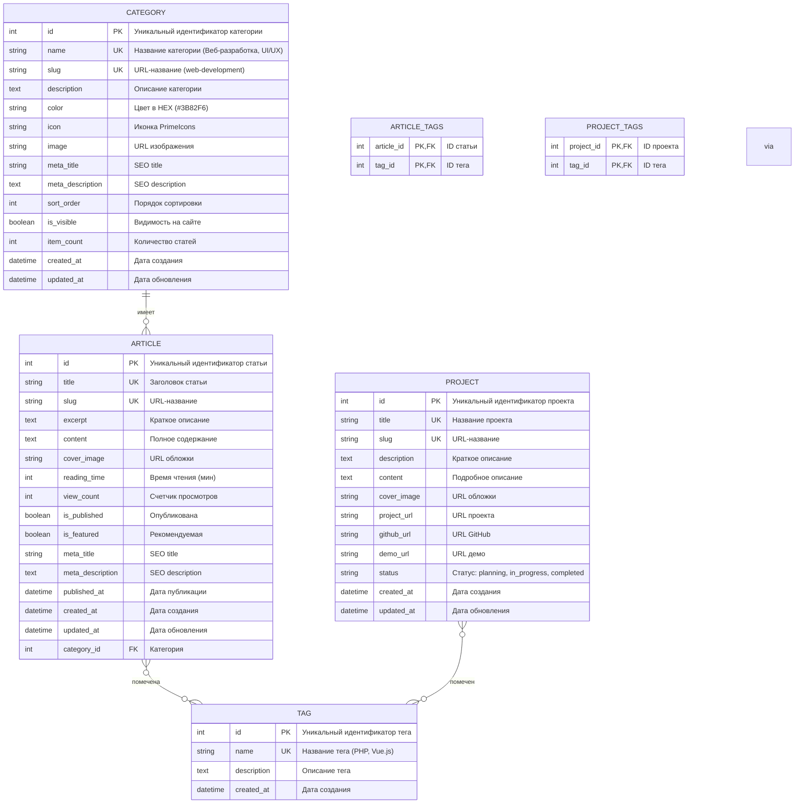

# 🗃️ Диаграмма базы данных портфолио

## Структура таблиц и связей

## 🔗 Описание связей

- **CATEGORY → ARTICLE**: Одна категория имеет много статей
- **ARTICLE ↔ TAG**: Многие-ко-многим через таблицу ARTICLE_TAGS  
- **PROJECT ↔ TAG**: Многие-ко-многим через таблицу PROJECT_TAGS

## 📊 Статистика
- **4 основные таблицы**
- **2 таблицы связей** 
- **15+ полей в основных таблицах**